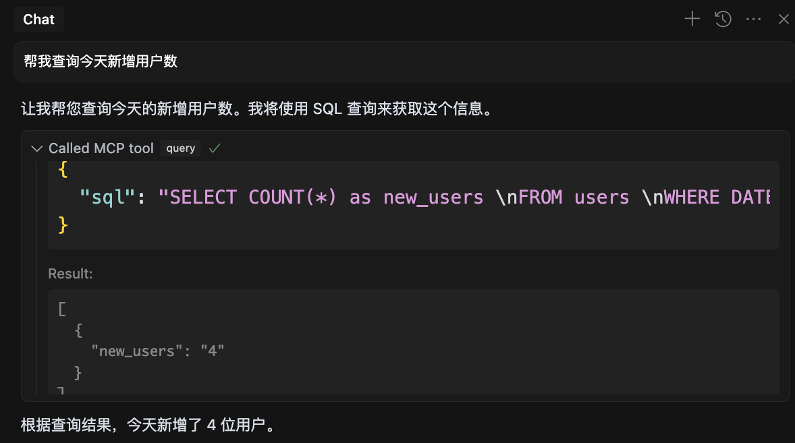

# 模型上下文协议 (MCP)

## 什么是模型上下文协议（MCP）？
MCP（Model Context Protocol）是由 Anthropic 推出的开放协议，旨在统一大型语言模型（LLM）与外部数据源、工具的通信标准。

它类似于“AI的USB-C接口”，通过标准化协议解决LLM因数据孤岛限制无法充分发挥潜力的问题。

MCP允许AI应用安全访问本地和远程资源（如数据库、API、文件系统等），并为开发者提供工具、资源和提示模板的集成能力。


## 核心概念与架构
MCP采用客户端-服务器架构，核心组件包括：

- **MCP主机（Host）**：运行LLM的应用程序（如Claude Desktop、Cursor）。

- **MCP客户端（Client）**：与服务器建立1:1连接的协议实现，负责将用户查询转发给LLM并执行工具调用。

- **MCP服务器（Server）**：提供三类功能：

  - **资源（Resources）**：如文件、API响应等可读取的数据。

  - **工具（Tools）**：可被LLM调用的函数（如数据库查询、Git操作）。

  - **提示（Prompts）**：预定义的交互模板，用于任务引导。

- **本地与远程资源**：涵盖本地文件、数据库，以及通过API连接的远程服务（如GitHub、Slack）。


## MCP的工作原理
1. **工具发现**：客户端从服务器获取可用工具列表。
2. **请求处理**：用户输入与工具描述一起发送给LLM，由其决定是否调用工具。
3. **工具执行**：若需调用工具，客户端通过服务器执行操作（如查询数据库）。
4. **结果整合**：工具返回的数据由LLM生成自然语言响应，最终展示给用户。

## 如何使用MCP

### 官方提供的服务器
Anthropic官方提供了多种预构建的MCP服务器，包括：
- **Filesystem** - 具有可配置访问控制的安全文件操作
- **Git** - 用于读取、搜索和操作Git仓库的工具
- **GitHub** - 仓库管理、文件操作和GitHub API集成
- **Brave Search** - 使用Brave的搜索API进行网络和本地搜索
- **Fetch** - 网络内容获取和转换以提高LLM使用效率
- **PostgreSQL** - 具有模式检查的只读数据库访问
- **Puppeteer** - 浏览器自动化和网络抓取
- **Memory** - 基于知识图谱的持久记忆系统

更多信息请访问：[GitHub上的MCP服务器](https://github.com/modelcontextprotocol/servers)


### 使用示例
在Cursor中使用PostgreSQL：

1. 在项目下配置特定的MCP服务器，使用`.cursor/mcp.json`文件。文件格式如下
  ```json
  {
    "mcpServers": {
      "postgres": {
        "command": "npx",
        "args": [
          "-y",
          "@modelcontextprotocol/server-postgres",
          "postgresql://<user>:<[password]>@localhost:5432/<database>"
        ]
      }
    }
  }
  ```

2. 现在，在Cursor中可以直接查询数据库。例如，假如有个user表，可以这样询问：
  > 帮我查询今天新增用户数

  返回的结果：
  

通过这种方式，MCP极大简化了与外部系统的交互，使得在Cursor中使用数据库查询变得更加便捷。

## 总结
MCP通过标准化协议极大简化了LLM与外部系统的交互，是构建复杂AI代理的关键技术。开发者可通过预构建的服务器快速接入常用服务，或基于SDK扩展自定义功能。